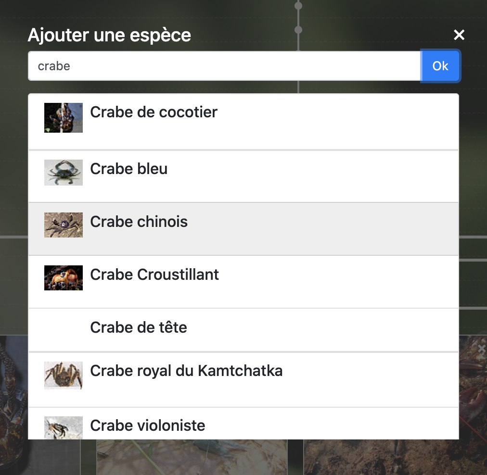

# animals-wiki

Side project to vizualize how different species relate to each other


### Install app

You need to have docker installed and run:

```
make init
```

### Run app

Run:

```
make start
```

- Go to `http://localhost:8200/`.
- Use the '+' button to add species (in french).
- Discover incredible species relations ;)

### Screenshots



